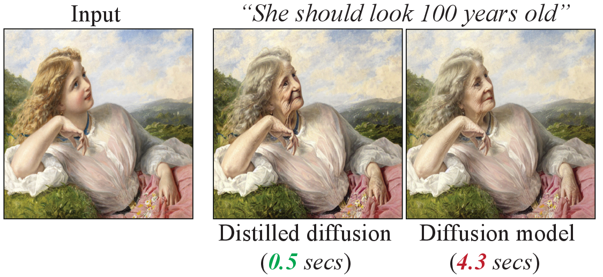
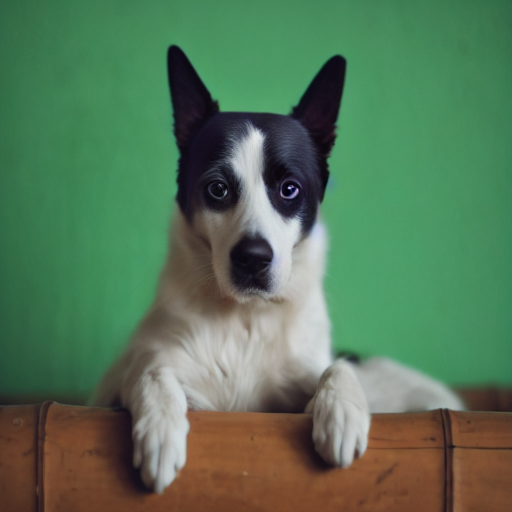
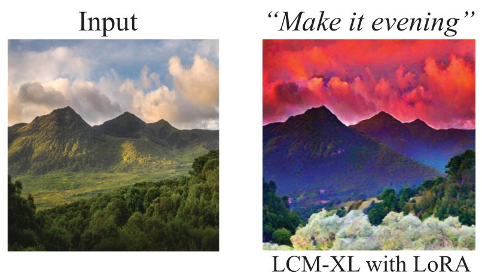
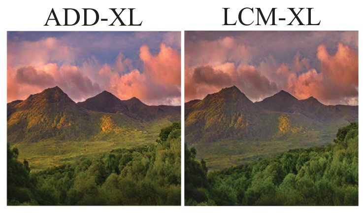
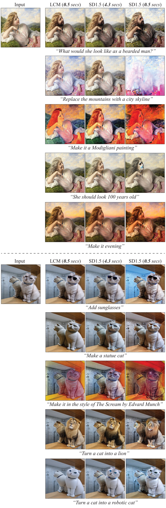
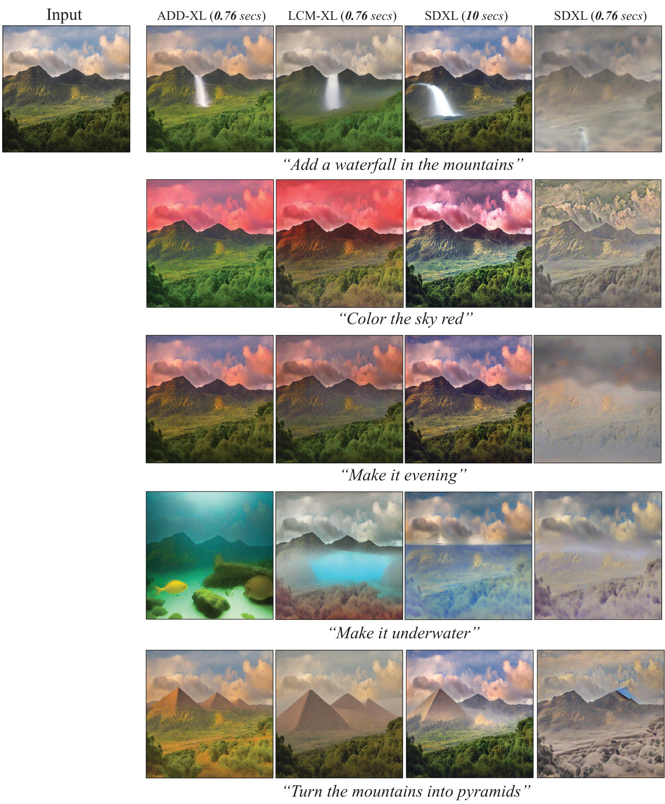

# Fast InstructPix2Pix using Distilled Text-conditional Diffusion Models
<a href="https://huggingface.co/spaces/dbaranchuk/instruct-p2p-distill">
	    
</a>&nbsp;

<p align="center">

</p>

> <i>Overview</i> <br> 
> InstructPix2Pix is a powerful AI-driven tool for interactive image editing, allowing users to modify an existing image based on textual instructions. This model builds on the strengths of diffusion models and employs fine-tuning for nuanced edits. Here's how it works and how you can use it effectively:

<i>Architecture</i> <br> 

>The InstructPix2Pix architecture builds upon diffusion models, which are popular in generative image tasks. It modifies and extends the standard image-to-image translation paradigm by incorporating instruction-conditioned fine-tuning and a diffusion-based generative model. Specifically, it extends the principles of image generation and editing using a text-conditioned approach. Here's an overview of the architecture and its components:

<i>Base Diffusion Model:</i> <br>

 > The foundation of InstructPix2Pix is built upon pre-trained diffusion models, which are probabilistic generative models designed to generate high-quality images by reversing a noise diffusion process.

> Diffusion models learn to reverse a noise process applied to images, progressively denoising them until they generate coherent images or edits.

Conditioning with Text Instructions:

The model is conditioned on both the original image and the text instruction.
Text Embeddings: A pre-trained language model, such as CLIP or T5, is used to encode the text instructions.
Image Features: A feature extractor (like a Vision Transformer or CNN) processes the input image to provide spatial and content-aware embeddings.

Cross-Attention Mechanism:

A cross-attention mechanism links the latent representation of the input image with the text embeddings from the instruction.
This ensures that the edits are contextually relevant to the textual input while preserving the original image's structure.

The model undergoes fine-tuning on an instruction-image-edit dataset.

Training
This training involves learning how to adjust image features based on specific, high-level textual commands, rather than purely stylistic or random transformations.
The editing process occurs in a modified U-Net architecture within the diffusion model.
The U-Net incorporates:
Cross-Attention Layers: To integrate the text embeddings with the image features.
Skip Connections: To preserve high-frequency details and structural integrity from the input image.
Learned Modifications: The model learns how to apply changes selectively, guided by the text input.
InstructPix2Pix is fine-tuned on a dataset of before-and-after image pairs with corresponding text instructions. 
This allows the model to learn nuanced relationships between textual descriptions and visual changes.

Latent Space Editing:

Images are encoded into a latent space using an encoder.
The latent representation is modified based on the text instruction, ensuring that changes are applied semantically rather than pixel-by-pixel.

Iterative Denoising

Similar to other diffusion models, the editing is achieved via iterative steps:
Noise is added to the input image.
Guided denoising is performed, conditioned on the text instruction, to reach the modified image.


> **Recent distillation approaches could significantly accerate the inference of text-conditional diffusion models.
> Here, we demonstrate that the distilled models can be readily combined with the high-end image editing approach, [InstructPix2Pix](https://github.com/timothybrooks/instruct-pix2pix/tree/main), 
> without any training.
> We adapt the InstructPix2Pix models based on [Stable Diffusion v1.5](https://arxiv.org/abs/2112.10752) and [Stable Diffusion XL](https://arxiv.org/abs/2307.01952) 
> using the pretrained [Latent Consistency Models](https://arxiv.org/abs/2310.04378)
> and [Adversarial Diffusion Distillation](https://arxiv.org/abs/2311.17042).
> The final pipeline performs the text-guided image editing for 4-5 steps without noticeable quality degradation.**
>
> <i>How does it work?</i> <br>
> 
> **The InstructPix2Pix parameters are updated according to $`W^{*}_{IP2P} = W_{IP2P} + \Delta W`$, where
> $`\Delta W = W_{1} - W_{0}`$. $`W_0`$ are the base diffusion model parameters, e.g., SD1.5 or SDXL, and
> $`W_1`$ are the parameters of the corresponding distilled version.**
> 
> **Also, $`\Delta W`$ can be obtained using LoRA adapters.
> First, the diffusion model is distilled into LoRA, 
> $`W_{1} = W_{0} + \Delta W_{LoRA}`$, that is usually added to the attention layers only.
> Then, we can adapt InstructPix2Pix using $`\Delta W = \Delta W_{LoRA}`$.
> Note that, in our experiments, InstructPix2Pix-XL performs much better using the fully parametrized distilled models for adaptation.**
>
> *The inference times are measured on a single NVIDIA-A100.

To run the code below, install [diffusers](https://github.com/huggingface/diffusers).
```Python
pip install diffusers==0.23.1
```

## TL;DR: quickstart 

Follow the instructions below to download and run InstructPix2Pix on your own images. These instructions have been tested on a GPU with >18GB VRAM. If you don't have a GPU, you may need to change the default configuratio.

### Set up a conda environment, and download a pretrained model:
```
conda env create -f environment.yaml
conda activate ip2p
bash scripts/download_checkpoints.sh
```

### Edit a single image:
```
python edit_cli.py --input imgs/example.jpg --output imgs/output.jpg --edit "turn him into a cyborg"

# Optionally, you can specify parameters to tune your result:
# python edit_cli.py --steps 100 --resolution 512 --seed 1371 --cfg-text 7.5 --cfg-image 1.2 --input imgs/example.jpg --output imgs/output.jpg --edit "turn him into a cyborg"
```

### Or launch your own interactive editing Gradio app:
```
python edit_app.py 
```


_(For advice on how to get the best results by tuning parameters, see the [Tips](https://github.com/timothybrooks/instruct-pix2pix#tips) section)._

## Setup

Install all dependencies with:
```
conda env create -f environment.yaml
```

Download the pretrained models by running:
```
bash scripts/download_checkpoints.sh
```

## Generated Dataset

Our image editing model is trained on a generated dataset consisting of 454,445 examples. Each example contains (1) an input image, (2) an editing instruction, and (3) an output edited image. We provide two versions of the dataset, one in which each pair of edited images is generated 100 times, and the best examples are chosen based on CLIP metrics (Section 3.1.2 in the paper) (`clip-filtered-dataset`), and one in which examples are randomly chosen (`random-sample-dataset`).

For the released version of this dataset, we've additionally filtered prompts and images for NSFW content. After NSFW filtering, the GPT-3 generated dataset contains 451,990 examples. The final image-pair datasets contain:

|  | # of image editing examples | Dataset size |
|--|-----------------------|----------------------- |
| `random-sample-dataset` |451990|727GB|
|  `clip-filtered-dataset` |313010|436GB|

To download one of these datasets, along with the entire NSFW-filtered text data, run the following command with the appropriate dataset name:

```
bash scripts/download_data.sh clip-filtered-dataset
```


## Training InstructPix2Pix

InstructPix2Pix is trained by fine-tuning from an initial StableDiffusion checkpoint. The first step is to download a Stable Diffusion checkpoint. For our trained models, we used the v1.5 checkpoint as the starting point. To download the same ones we used, you can run the following script:
```
bash scripts/download_pretrained_sd.sh
```
If you'd like to use a different checkpoint, point to it in the config file `configs/train.yaml`, on line 8, after `ckpt_path:`. 

Next, we need to change the config to point to our downloaded (or generated) dataset. If you're using the `clip-filtered-dataset` from above, you can skip this. Otherwise, you may need to edit lines 85 and 94 of the config (`data.params.train.params.path`, `data.params.validation.params.path`). 

Finally, start a training job with the following command:

```
python main.py --name default --base configs/train.yaml --train --gpus 0,1,2,3,4,5,6,7
```


## Creating your own dataset

Our generated dataset of paired images and editing instructions is made in two phases: First, we use GPT-3 to generate text triplets: (a) a caption describing an image, (b) an edit instruction, (c) a caption describing the image after the edit. Then, we turn pairs of captions (before/after the edit) into pairs of images using Stable Diffusion and Prompt-to-Prompt.

### (1) Generate a dataset of captions and instructions

We provide our generated dataset of captions and edit instructions [here](https://instruct-pix2pix.eecs.berkeley.edu/gpt-generated-prompts.jsonl). If you plan to use our captions+instructions, skip to step (2). Otherwise, if you would like to create your own text dataset, please follow steps (1.1-1.3) below. Note that generating very large datasets using GPT-3 can be expensive.

#### (1.1) Manually write a dataset of instructions and captions

The first step of the process is fine-tuning GPT-3. To do this, we made a dataset of 700 examples broadly covering of edits that we might want our model to be able to perform. Our examples are available [here](https://instruct-pix2pix.eecs.berkeley.edu/human-written-prompts.jsonl). These should be diverse and cover a wide range of possible captions and types of edits. Ideally, they should avoid duplication or significant overlap of captions and instructions. It is also important to be mindful of limitations of Stable Diffusion and Prompt-to-Prompt in writing these examples, such as inability to perform large spatial transformations (e.g., moving the camera, zooming in, swapping object locations). 

Input prompts should closely match the distribution of input prompts used to generate the larger dataset. We sampled the 700 input prompts from the _LAION Improved Aesthetics 6.5+_ dataset and also use this dataset for generating examples. We found this dataset is quite noisy (many of the captions are overly long and contain irrelevant text). For this reason, we also considered MSCOCO and LAION-COCO datasets, but ultimately chose _LAION Improved Aesthetics 6.5+_ due to its diversity of content, proper nouns, and artistic mediums. If you choose to use another dataset or combination of datasets as input to GPT-3 when generating examples, we recommend you sample the input prompts from the same distribution when manually writing training examples.

#### (1.2) Finetune GPT-3

The next step is to finetune a large language model on the manually written instructions/outputs to generate edit instructions and edited caption from a new input caption. For this, we finetune GPT-3's Davinci model via the OpenAI API, although other language models could be used.

To prepare training data for GPT-3, one must first create an OpenAI developer account to access the needed APIs, and [set up the API keys on your local device](https://beta.openai.com/docs/api-reference/introduction). Also, run the `prompts/prepare_for_gpt.py` script, which forms the prompts into the correct format by concatenating instructions and captions and adding delimiters and stop sequences.

```bash
python dataset_creation/prepare_for_gpt.py --input-path data/human-written-prompts.jsonl --output-path data/human-written-prompts-for-gpt.jsonl
```

Next, finetune GPT-3 via the OpenAI CLI. We provide an example below, although please refer to OpenAI's official documentation for this, as best practices may change. We trained the Davinci model for a single epoch. You can experiment with smaller less expensive GPT-3 variants or with open source language models, although this may negatively affect performance.

```bash
openai api fine_tunes.create -t data/human-written-prompts-for-gpt.jsonl -m davinci --n_epochs 1 --suffix "instruct-pix2pix"
```

You can test out the finetuned GPT-3 model by launching the provided Gradio app:

```bash
python prompt_app.py --openai-api-key OPENAI_KEY --openai-model OPENAI_MODEL_NAME
```


#### (1.3) Generate a large dataset of captions and instructions

We now use the finetuned GPT-3 model to generate a large dataset. Our dataset cost thousands of dollars to create. See `prompts/gen_instructions_and_captions.py` for the script which generates these examples. We recommend first generating a small number of examples (by setting a low value of `--num-samples`) and gradually increasing the scale to ensure the results are working as desired before increasing scale.

```bash
python dataset_creation/generate_txt_dataset.py --openai-api-key OPENAI_KEY --openai-model OPENAI_MODEL_NAME
```

If you are generating at a very large scale (e.g., 100K+), it will be noteably faster to generate the dataset with multiple processes running in parallel. This can be accomplished by setting `--partitions=N` to a higher number and running multiple processes, setting each `--partition` to the corresponding value.

```bash
python dataset_creation/generate_txt_dataset.py --openai-api-key OPENAI_KEY --openai-model OPENAI_MODEL_NAME --partitions=10 --partition=0
```

### (2) Turn paired captions into paired images

The next step is to turn pairs of text captions into pairs of images. For this, we need to copy some pre-trained Stable Diffusion checkpoints to `stable_diffusion/models/ldm/stable-diffusion-v1/`. You may have already done this if you followed the instructions above for training with our provided data, but if not, you can do this by running:

```bash
bash scripts/download_pretrained_sd.sh
```

For our model, we used [checkpoint v1.5](https://huggingface.co/runwayml/stable-diffusion-v1-5/blob/main/v1-5-pruned.ckpt), and the [new autoencoder](https://huggingface.co/stabilityai/sd-vae-ft-mse-original/resolve/main/vae-ft-mse-840000-ema-pruned.ckpt), but other models may work as well. If you choose to use other models, make sure to change point to the corresponding checkpoints by passing in the `--ckpt` and `--vae-ckpt` arguments. Once all checkpoints have been downloaded, we can generate the dataset with the following command:

```
python dataset_creation/generate_img_dataset.py --out_dir data/instruct-pix2pix-dataset-000 --prompts_file path/to/generated_prompts.jsonl
```

This command operates on a single GPU (typically a V100 or A100). To parallelize over many GPUs/machines, set `--n-partitions` to the total number of parallel jobs and `--partition` to the index of each job.

```
python dataset_creation/generate_img_dataset.py --out_dir data/instruct-pix2pix-dataset-000 --prompts_file path/to/generated_prompts.jsonl --n-partitions 100 --partition 0
```

The default parameters match that of our dataset, although in practice you can use a smaller number of steps (e.g., `--steps=25`) to generate high quality data faster. By default, we generate 100 samples per prompt and use CLIP filtering to keep a max of 4 per prompt. You can experiment with fewer samples by setting `--n-samples`. The command below turns off CLIP filtering entirely and is therefore faster:

```
python dataset_creation/generate_img_dataset.py --out_dir data/instruct-pix2pix-dataset-000 --prompts_file path/to/generated_prompts.jsonl --n-samples 4 --clip-threshold 0 --clip-dir-threshold 0 --clip-img-threshold 0 --n-partitions 100 --partition 0
```

After generating all of the dataset examples, run the following command below to create a list of the examples. This is needed for the dataset onject to efficiently be able to sample examples without needing to iterate over the entire dataset directory at the start of each training run.

```
python dataset_creation/prepare_dataset.py data/instruct-pix2pix-dataset-000
```

## Evaluation

To generate plots like the ones in Figures 8 and 10 in the paper, run the following command:

```
python metrics/compute_metrics.py --ckpt /path/to/your/model.ckpt

```
<p align="center">

</p>

You can find more examples [here](#examples-with-lcm-sd15).

> <i>Recomendations</i> <br>
> 
> **a) Turn off ```image_guidance_scale``` (set to ```1```). Otherwise, it will cause artifacts.** <br>
> **b) Vary ```guidance_scale``` between ```1``` and ```3```. The larger values can potentially lead to more artifacts.** <br>
> **c) Different resolutions are suitable (e.g, ```1024```). However, ```512``` works slightly better.** <br>

## Editing with LCM-XL and ADD-XL
For SDXL, we found that [LCM-LoRA-XL](https://huggingface.co/latent-consistency/lcm-lora-sdxl) leads to 
the unsatisfactory results, see the example below. 
<p align="center">

</p>

However, we observe that the [LCM-XL](https://huggingface.co/latent-consistency/lcm-sdxl) and 
[ADD-XL](https://huggingface.co/stabilityai/sdxl-turbo) checkpoints can be successfully used for the InstructPix2Pix-XL adaptation.

1. Load an image

```Python
from diffusers.utils import load_image

url = "https://hf.co/datasets/diffusers/diffusers-images-docs/resolve/main/mountain.png"
resolution = 768

init_image = load_image(url).resize((resolution, resolution))
```
<p align="center">

</p>

2. Initialize the pipelines
```Python
from diffusers import DiffusionPipeline, StableDiffusionXLInstructPix2PixPipeline, AutoPipelineForText2Image
from diffusers import UNet2DConditionModel, LCMScheduler

# InstructPix2Pix-XL with LCM specified scheduler
pipe_p2p = StableDiffusionXLInstructPix2PixPipeline.from_pretrained(
        "diffusers/sdxl-instructpix2pix-768",
        torch_dtype=torch.float16
       )
pipe_p2p = pipe_p2p.to("cuda")
pipe_p2p.scheduler = LCMScheduler.from_config(pipe_p2p.scheduler.config)

# SDXL
pipe_sd = DiffusionPipeline.from_pretrained(
    "stabilityai/stable-diffusion-xl-base-1.0", torch_dtype=torch.float16, variant="fp16", use_safetensors=True
)
pipe_sd = pipe_sd.to("cuda")

# ADD-XL (SDXL-Turbo)
pipe_turbo = AutoPipelineForText2Image.from_pretrained("stabilityai/sdxl-turbo",
                                                 torch_dtype=torch.float16, variant="fp16")
pipe_turbo.to("cuda")

# LCM-XL
unet = UNet2DConditionModel.from_pretrained("latent-consistency/lcm-sdxl", torch_dtype=torch.float16, variant="fp16").to("cuda")
pipe_lcm = DiffusionPipeline.from_pretrained("stabilityai/stable-diffusion-xl-base-1.0", unet=unet, torch_dtype=torch.float16, variant="fp16")
pipe_lcm.scheduler = LCMScheduler.from_config(pipe_lcm.scheduler.config)
```

**Adapt InstructPix2Pix-XL**

```Python
import torch

@torch.no_grad()
def adapt(pipe_p2p, pipe_distill, pipe_sd, weight=0.5):
    """
    Adaptation of pipe_p2p with pipe_distill and pipe_sd inspired by LoRA adapters
    """
    
    state_dict_p2p = pipe_p2p.unet.state_dict()
    state_dict_distill = pipe_distill.unet.state_dict()
    state_dict_sd = pipe_sd.unet.state_dict()
    
    for name, param in state_dict_p2p.items():
        
        # Skip the first layer, since it has more input channels than in the distill model.
        if name == 'conv_in.weight':
            continue
        
        # Compute weight residuals
        W_delta = state_dict_distill[name] - state_dict_sd[name] 
        
        # Update parameters
        transformed_param = param + weight * W_delta
        param.copy_(transformed_param)

# Adapt InstructPix2Pix-XL using the selected distillation method
adapt(pipe_p2p=pipe_p2p,
      pipe_distill=pipe_turbo, # or pipe_lcm
      pipe_sd=pipe_sd,
      weight=0.5) 
```

3. Run editing.
```Python
edit_instruction = "Make it evening"
edited_image = pipe_p2p(
        prompt=edit_instruction,
        image=init_image,
        height=resolution,
        width=resolution,
        num_inference_steps=5,
        guidance_scale=2.0,
        image_guidance_scale=1.0,
        ).images[0]
```

<p align="center">

</p>

You can find more examples [here](#examples-with-lcm-sdxl-and-add-xl).

> <i>Recomendations</i> <br>
> 
> **a) As in the previous case, turn off ```image_guidance_scale``` (set to ```1```).** <br>
> **b) Vary ```guidance_scale``` between ```1``` and ```3```.** <br>
> **c) Only one resolution is suitable, ```768```. Others lead to the unsatisfactory results.** <br>
> **d) The pipeline is highly sensitive to the ```weight``` parameter. We found that ```0.5``` is acceptable.** <br>
> **e) InstructPix2Pix-SD1.5 works significantly better than the SDXL counterpart. Thus, we recommend using the previous pipeline.**

## Examples with LCM-SD1.5
<p align="center">

</p>

## Examples with LCM-SDXL and ADD-XL
<p align="center">

</p>

## References
```bibtex
@article{brooks2022instructpix2pix,
  title={InstructPix2Pix: Learning to Follow Image Editing Instructions},
  author={Brooks, Tim and Holynski, Aleksander and Efros, Alexei A},
  journal={arXiv preprint arXiv:2211.09800},
  year={2022}
}

@article{luo2023latent,
  title={Latent consistency models: Synthesizing high-resolution images with few-step inference},
  author={Luo, Simian and Tan, Yiqin and Huang, Longbo and Li, Jian and Zhao, Hang},
  journal={arXiv preprint arXiv:2310.04378},
  year={2023}
}

@article{luo2023lcm,
  title={Lcm-lora: A universal stable-diffusion acceleration module},
  author={Luo, Simian and Tan, Yiqin and Patil, Suraj and Gu, Daniel and von Platen, Patrick and Passos, Apolin{\'a}rio and Huang, Longbo and Li, Jian and Zhao, Hang},
  journal={arXiv preprint arXiv:2311.05556},
  year={2023}
}

@article{sauer2023adversarial,
  title={Adversarial Diffusion Distillation},
  author={Sauer, Axel and Lorenz, Dominik and Blattmann, Andreas and Rombach, Robin},
  journal={arXiv preprint arXiv:2311.17042},
  year={2023}
}
```
